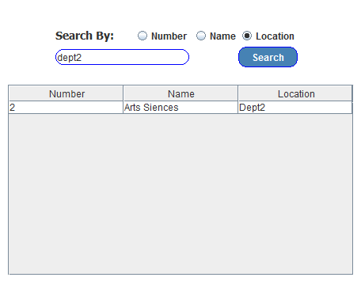

# Departement_Management

<h3>Login Form</h3>

 
<h3>departemlent Form </h3>

 
<h3>Add New Departement</h3>

 
<h3>Update and Delete Departement</h3>
<h4> When You Select Row From The Table, Update and Delete Buttons Will Be Able To Delete or Update The Data Of The Row That You Selectes. </h4>

 
<h3>Search Departement From The Table</h3>
<dl>
  <dt> You can Search the departement By
  <dd> No
  <dd> Name
  <dd> Location
 

 
<h3>Find Departement By Id</h3>

