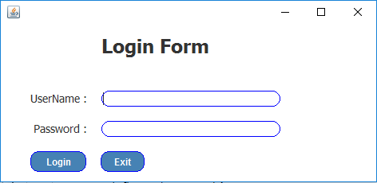

# Departement_Management

 Before run the application you need to import the file "mydata.sql" in wamp or xamp server to prepare the DATABASE.  
 open your Neetbeans or Jetbrain IDE and Open the project. 
 Then You Should to import package from the folder "java_package/Myommon.Jar" in your project. 
 Run your project  
 userName: "admin"/ password:"admin" 

  

 
<h3>Login Form</h3>

 
<h3>departemlent Form </h3>

 
<h3>Add New Departement</h3>

 
<h3>Update and Delete Departement</h3>
<h4> When you select row From the table, Update and Delete buttons will be able to Delete or Update the Data of the row that you selected. </h4>

 
<h3>Search Departement From The Table</h3>
<h4> able to search the departement By <h4>
<ul>
  <li>Number</li>
  <li>Name</li>
  <li>Location</li>
</ul>

 
<h3>Find departement by ID</h3>

